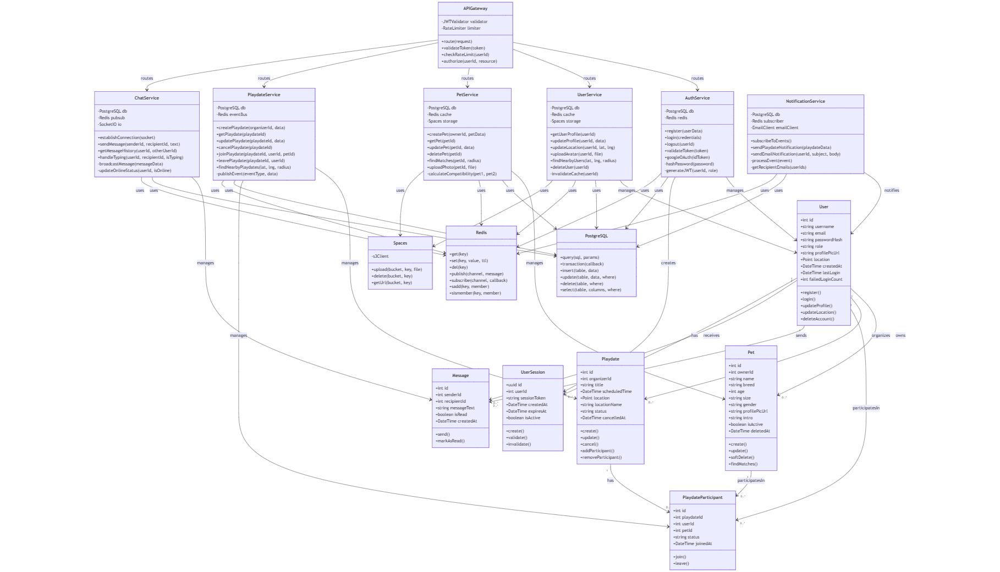
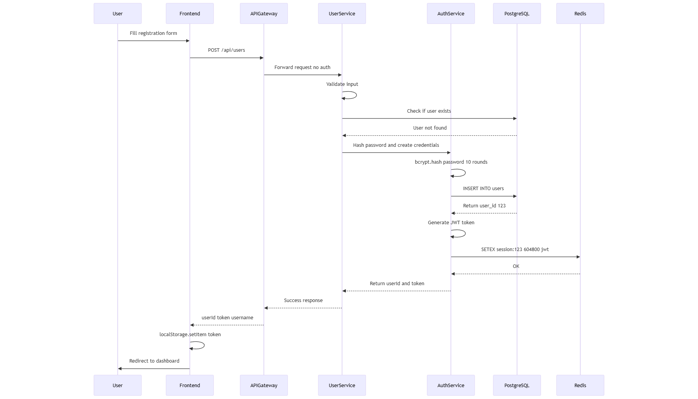
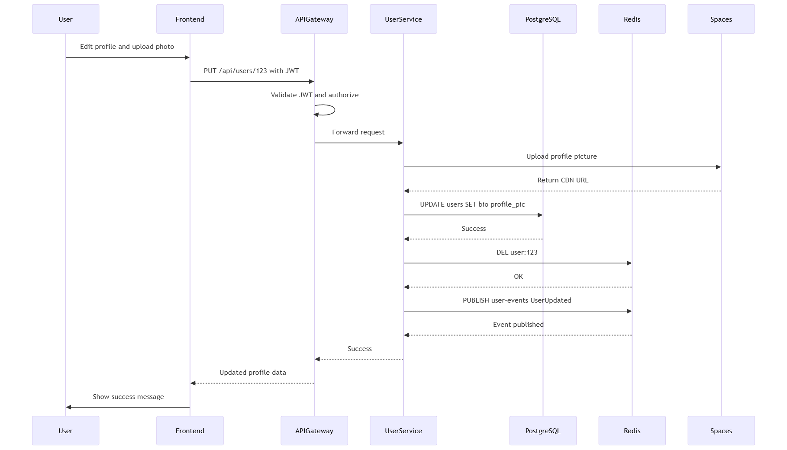
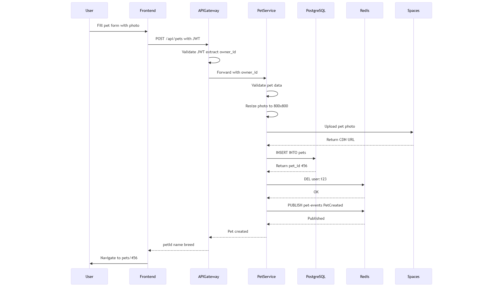
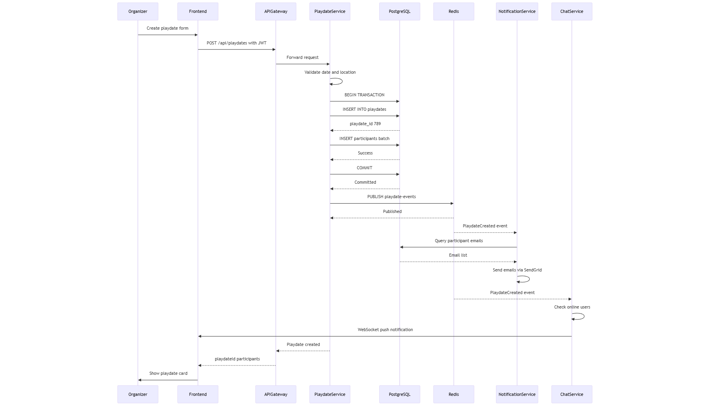
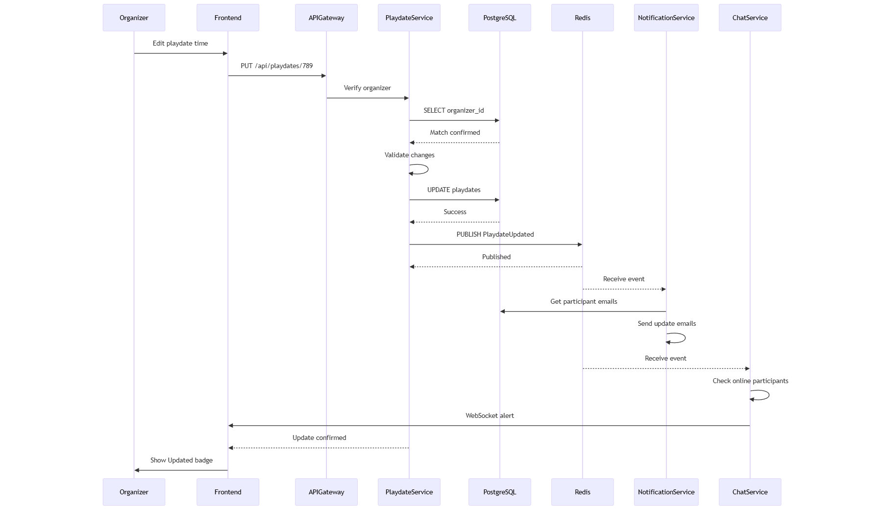
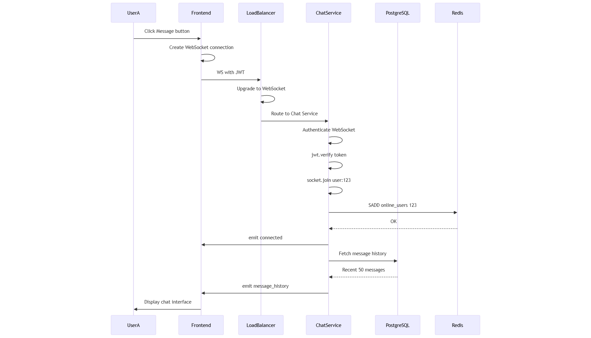
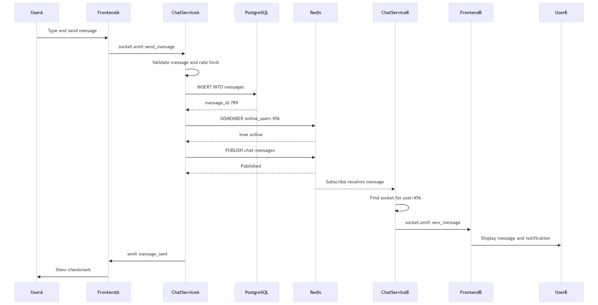

# WolfWhere

## Infrastructure Overview

**Total VMs:** 3
- **VM #1:** Kubernetes Worker Node 1
- **VM #2:** Kubernetes Worker Node 2
- **VM #3:** Combined Database Server

## 1. User Profile CRUD Operations

### 1.1 CREATE - User Registration

**Endpoint:** `POST /api/users`

**Flow Steps:**

1. **Frontend**
   - User fills registration form: username, email, password, optional location
   - Action: POST /api/users

2. **API Gateway**
   - Route to User Service (no auth required)
   - Forward request

3. **User Service**
   - Validate input data:
     - Email format validation
     - Username: 3-30 chars, alphanumeric
     - Password: 8+ chars with uppercase & number
   - Check if user exists

4. **PostgreSQL**
   - Query: `SELECT id FROM users WHERE email=$1 OR username=$2`
   - Return 409 if exists

5. **User Service**
   - Hash password with bcrypt (10 salt rounds)
   - `bcrypt.hash(password, 10)`

6. **PostgreSQL**
   - Insert into users table:
   ```sql
   INSERT INTO users (username, email, password_hash, location, role, created_at)
   VALUES ($1, $2, $3, ST_SetSRID(ST_MakePoint($4, $5), 4326), 'user', NOW())
   RETURNING id, username, email
   ```

7. **User Service**
   - Generate JWT token
   - `jwt.sign({userId, role}, SECRET, {expiresIn: "7d"})`

8. **Redis**
   - Store session: `SETEX session:123 604800 "jwt-token"` (7 day TTL)

9. **User Service**
   - Return response: `{ userId: 123, token: "jwt...", username: "john" }`

10. **Frontend**
    - Save token to localStorage
    - Redirect to dashboard

---

### 1.2 READ - Get User Profile

**Endpoint:** `GET /api/users/:id`

**Flow Steps:**

1. **Frontend**
   - Request user profile with Authorization header
   - `GET /api/users/123` with `Authorization: Bearer jwt-token`

2. **API Gateway**
   - Validate JWT token: `jwt.verify(token, SECRET)`
   - Extract userId from token

3. **Redis**
   - Validate session exists: `GET session:123`
   - Return token or NULL

4. **User Service**
   - Check cache first: `GET user:123` from Redis

5. **Redis**
   - Cache miss (key not found or expired)

6. **PostgreSQL**
   - Complex JOIN query:
   ```sql
   SELECT u.*, COUNT(p.id) as pet_count
   FROM users u
   LEFT JOIN pets p ON u.id = p.owner_id
   WHERE u.id = $1
   GROUP BY u.id
   ```

7. **User Service**
   - Cache result: `SETEX user:123 300 {...}` (5 min TTL)

8. **Frontend**
   - Display profile: username, bio, location on map, pet count

---

### 1.3 UPDATE - Edit User Profile

**Endpoint:** `PUT /api/users/:id`

**Flow Steps:**

1. **Frontend**
   - User edits profile form: bio, location, profile picture
   - `PUT /api/users/123` with multipart/form-data

2. **API Gateway**
   - Validate JWT & authorization
   - Check token userId matches :id param (RBAC)

3. **User Service**
   - Handle file upload: `multer.single("avatar")`
   - Validate type (jpg/png) & size (<5MB)

4. **Spaces (DigitalOcean Object Storage)**
   - Upload to bucket:
   ```javascript
   s3.upload({
     Bucket: 'dog-playdate-media',
     Key: 'profiles/123/timestamp.jpg',
     ACL: 'public-read'
   })
   ```
   - Return CDN URL

5. **User Service**
   - Delete old profile picture from Spaces

6. **PostgreSQL**
   - Update users table:
   ```sql
   UPDATE users 
   SET bio=$1, location=$2, user_profile_pic_url=$3 
   WHERE id=$4
   ```

7. **Redis**
   - Invalidate cache: `DEL user:123`

8. **Redis**
   - Publish event:
   ```json
   PUBLISH user-events {
     "type": "UserUpdated",
     "userId": 123,
     "changes": ["bio", "location"]
   }
   ```

9. **Frontend**
   - Show success message, refresh profile display

---

### 1.4 DELETE - Delete User Account

**Endpoint:** `DELETE /api/users/:id`

**Flow Steps:**

1. **Frontend**
   - User confirms deletion
   - Warning: "This will delete all pets, playdates, messages"

2. **API Gateway**
   - Validate JWT & authorization

3. **User Service**
   - Check active dependencies (playdates, messages)

4. **PostgreSQL**
   - Begin CASCADE delete transaction:
   ```sql
   BEGIN;
   DELETE FROM user_sessions WHERE user_id = $1;
   DELETE FROM playdate_participants WHERE user_id = $1;
   DELETE FROM pets WHERE owner_id = $1;
   DELETE FROM messages WHERE sender_id = $1 OR recipient_id = $1;
   DELETE FROM users WHERE id = $1;
   COMMIT;
   ```

5. **Spaces**
   - Delete all user media: `profiles/123/*, pets/owner_123/*`

6. **Redis**
   - Purge all user data:
   ```
   DEL user:123
   DEL session:123
   DEL nearby:*
   SREM online_users 123
   ```

7. **Frontend**
   - Clear localStorage
   - Redirect to homepage with farewell message

---

## 2. Pet Profile CRUD Operations

### 2.1 CREATE - Add New Pet

**Endpoint:** `POST /api/pets`

**Flow Steps:**

1. **Frontend**
   - User fills pet form: name, breed, age (months), size, gender, intro, photo
   - `POST /api/pets` with multipart/form-data

2. **API Gateway**
   - Validate JWT, extract owner_id from token

3. **Pet Service**
   - Validate pet data:
     - Name required
     - Age: 0-300 months
     - Size: enum (small/medium/large)
     - Breed: max 100 chars

4. **Pet Service**
   - Validate & resize photo using sharp library
   - Resize to 800x800px

5. **Spaces**
   - Upload pet photo:
   ```
   PUT pets/owner_123/pet_timestamp.jpg
   Cache-Control: max-age=31536000
   ```

6. **PostgreSQL**
   - Insert into pets table:
   ```sql
   INSERT INTO pets (
     owner_id, name, breed, age, size, gender,
     pet_profile_pic_url, intro, is_active
   ) VALUES ($1, $2, $3, $4, $5, $6, $7, $8, true)
   RETURNING id
   ```

7. **Redis**
   - Invalidate owner cache: `DEL user:123` (pet count changed)

8. **Redis**
   - Publish event:
   ```json
   PUBLISH pet-events {
     "type": "PetCreated",
     "petId": 456,
     "ownerId": 123
   }
   ```

9. **Frontend**
   - Show success toast: "Max added successfully!"
   - Redirect to `/pets/456`

---

### 2.2 READ - Get Pet Profile

**Endpoint:** `GET /api/pets/:id`

**Flow Steps:**

1. **Frontend**
   - View pet profile with JWT

2. **API Gateway**
   - Validate authentication

3. **Pet Service**
   - Check cache: `GET pet:456` from Redis

4. **PostgreSQL**
   - SELECT with owner JOIN:
   ```sql
   SELECT p.*, u.username as owner_name, u.location
   FROM pets p
   JOIN users u ON p.owner_id = u.id
   WHERE p.id = $1 AND p.is_active = true
   ```

5. **Pet Service**
   - Calculate age display (convert months to years/months)

6. **Redis**
   - Cache pet data: `SETEX pet:456 600 {...}` (10 min TTL)

7. **Frontend**
   - Display pet card: photo, name, breed, age, owner, "Find Matches" button

---

### 2.3 UPDATE - Edit Pet Profile

**Endpoint:** `PUT /api/pets/:id`

**Flow Steps:**

1. **Frontend**
   - User edits pet info: age, intro, photo

2. **API Gateway**
   - Validate JWT

3. **Pet Service**
   - Verify ownership:
   ```sql
   SELECT owner_id FROM pets WHERE id = 456
   ```
   - Compare with JWT userId

4. **Spaces**
   - Delete old photo, upload new photo
   - Return new CDN URL

5. **PostgreSQL**
   - Update pets table:
   ```sql
   UPDATE pets 
   SET age=$1, intro=$2, pet_profile_pic_url=$3 
   WHERE id=$4
   ```

6. **Redis**
   - Clear caches:
   ```
   DEL pet:456
   DEL pet_matches:*
   DEL nearby_pets:*
   ```

7. **Redis**
   - Publish event:
   ```json
   PUBLISH pet-events {
     "type": "PetUpdated",
     "petId": 456,
     "changes": ["age", "photo"]
   }
   ```

8. **Frontend**
   - Refresh pet display, show success message

---

### 2.4 DELETE - Remove Pet (Soft Delete)

**Endpoint:** `DELETE /api/pets/:id`

**Flow Steps:**

1. **Frontend**
   - Confirm deletion
   - Warning: "Pet will be removed from all future playdates"

2. **API Gateway**
   - Validate JWT & ownership

3. **PostgreSQL**
   - Check future playdates:
   ```sql
   SELECT COUNT(*) 
   FROM playdate_participants pp
   JOIN playdates p ON pp.playdate_id = p.id
   WHERE pp.pet_id = 456 
   AND p.scheduled_time > NOW()
   ```

4. **PostgreSQL**
   - Soft delete:
   ```sql
   UPDATE pets 
   SET is_active = false, deleted_at = NOW() 
   WHERE id = 456
   ```

5. **Redis**
   - Purge caches:
   ```
   DEL pet:456
   DEL pet_matches:*
   DEL user:owner_id
   ```

6. **Pet Service**
   - Queue hard delete job (delete Spaces photos after 30 days)

7. **Frontend**
   - Remove from UI, show undo option (30-day recovery period)

---

## 3. Playdate CRUD Operations

### 3.1 CREATE - Schedule Playdate

**Endpoint:** `POST /api/playdates`

**Flow Steps:**

1. **Frontend**
   - User creates playdate: title, datetime, map location, invited pets
   - `POST /api/playdates`

2. **API Gateway**
   - Validate JWT, extract organizer_id

3. **Playdate Service**
   - Validate data:
     - `scheduled_time > NOW()`
     - Valid coordinates
     - Max 20 participants

4. **PostgreSQL**
   - Start transaction and insert:
   ```sql
   BEGIN;
   INSERT INTO playdates (
     organizer_id, title, scheduled_time, 
     location, location_name, status
   ) VALUES ($1, $2, $3, 
     ST_SetSRID(ST_MakePoint($4, $5), 4326), 
     $6, 'upcoming'
   ) RETURNING id;
   ```

5. **PostgreSQL**
   - Batch insert participants:
   ```sql
   INSERT INTO playdate_participants 
   (playdate_id, user_id, pet_id, status)
   VALUES 
     (789, 123, 456, 'confirmed'),
     (789, 234, 567, 'confirmed'),
     ...;
   COMMIT;
   ```

6. **Redis**
   - Publish event:
   ```json
   PUBLISH playdate-events {
     "type": "PlaydateCreated",
     "playdateId": 789,
     "participantIds": [123, 456, 789]
   }
   ```

7. **Notification Service** (Async subscriber)
   - Query participant emails
   - Send via SendGrid

8. **Chat Service** (WebSocket)
   - Push notification to online participants
   - "You're invited to a playdate!"

9. **Frontend**
   - Display playdate card, add to calendar

---

### 3.2 READ - View Playdate Details

**Endpoint:** `GET /api/playdates/:id`

**Flow Steps:**

1. **Frontend**
   - Request playdate details with JWT

2. **API Gateway**
   - Validate authentication

3. **Playdate Service**
   - Verify user is participant (privacy check)

4. **PostgreSQL**
   - Complex JOIN query:
   ```sql
   SELECT 
     p.*,
     u.username,
     pet.name,
     ST_Distance(
       p.location, 
       current_user.location
     ) / 1000 as distance_km
   FROM playdates p
   JOIN playdate_participants pp ON p.id = pp.playdate_id
   JOIN users u ON pp.user_id = u.id
   JOIN pets ON pp.pet_id = pets.id
   WHERE p.id = $1
   ```

5. **PostgreSQL**
   - Get participant list:
   ```sql
   SELECT u.id, u.username, p.id as pet_id, 
          p.name as pet_name, p.pet_profile_pic_url
   FROM playdate_participants pp
   JOIN users u ON pp.user_id = u.id
   JOIN pets p ON pp.pet_id = p.id
   WHERE pp.playdate_id = $1
   ```

6. **Playdate Service**
   - Add computed fields:
     - `distance_km`
     - `time_until_playdate`
     - `is_organizer`
     - `can_edit`

7. **Frontend**
   - Display: map with marker, participant avatars, join/leave button, countdown

---

### 3.3 UPDATE - Edit Playdate

**Endpoint:** `PUT /api/playdates/:id`

**Flow Steps:**

1. **Frontend**
   - Organizer edits: time, location, or participants

2. **API Gateway**
   - Validate JWT

3. **Playdate Service**
   - Verify organizer:
   ```sql
   SELECT organizer_id 
   FROM playdates 
   WHERE id = 789
   ```
   - Must match JWT userId

4. **Playdate Service**
   - Validate changes:
     - New time in future
     - Location valid
     - Not within 2 hours of the event

5. **PostgreSQL**
   - Update playdate:
   ```sql
   UPDATE playdates 
   SET title=$1, scheduled_time=$2, location=$3 
   WHERE id=$4
   ```

6. **Redis**
   - Publish event (include old & new values):
   ```json
   PUBLISH playdate-events {
     "type": "PlaydateUpdated",
     "playdateId": 789,
     "changes": {
       "scheduled_time": {
         "old": "2025-01-15 15:00",
         "new": "2025-01-15 17:00"
       }
     },
     "participantIds": [123, 456, 789]
   }
   ```

7. **Notification Service**
   - Send update emails: "Playdate time changed from 3PM to 5PM"
   - High priority

8. **Chat Service**
   - WebSocket push to online users immediately

9. **Frontend**
   - Update calendar, show "Updated" badge

---

### 3.4 DELETE - Cancel Playdate

**Endpoint:** `DELETE /api/playdates/:id`

**Flow Steps:**

1. **Frontend**
   - Organizer cancels with confirmation
   - "This will notify all participants"

2. **API Gateway**
   - Validate JWT & ownership

3. **Playdate Service**
   - Check cancellation time
   - If <24hrs before event, send urgent notification

4. **PostgreSQL**
   - Soft delete (status change):
   ```sql
   UPDATE playdates 
   SET status='cancelled', cancelled_at=NOW() 
   WHERE id=789;
   
   UPDATE playdate_participants 
   SET status='cancelled' 
   WHERE playdate_id=789;
   ```

5. **Redis**
   - Publish cancellation:
   ```json
   PUBLISH playdate-events {
     "type": "PlaydateCancelled",
     "playdateId": 789,
     "reason": "Weather conditions",
     "participantIds": [123, 456, 789]
   }
   ```

6. **Notification Service**
   - Urgent email blast to all participants

7. **Chat Service**
   - Push cancellation alert via WebSocket

8. **Frontend**
   - Remove from calendar or show "Cancelled" badge

---

## 4. Chat Message Operations

### 4.1 SETUP - Establish Chat Session

**Endpoint:** `WebSocket wss://api.dogplaydate.com/ws/chat`

**Flow Steps:**

1. **Frontend**
   - User clicks "Message" button on profile
   - Create WebSocket connection:
   ```javascript
   socket = io("wss://api.dogplaydate.com", {
     auth: { token: jwt }
   })
   ```

2. **Load Balancer**
   - HTTP → WebSocket protocol upgrade
   - Route to Chat Service pod

3. **Chat Service**
   - Authenticate WebSocket in middleware:
   ```javascript
   io.use((socket, next) => {
     const token = socket.handshake.auth.token;
     jwt.verify(token, SECRET, (err, decoded) => {
       if (err) return next(new Error('Authentication error'));
       socket.userId = decoded.userId;
       next();
     });
   });
   ```

4. **Chat Service**
   - Join personal room for receiving messages:
   ```javascript
   socket.join(`user:${userId}`)
   ```

5. **Redis**
   - Add to online users:
   ```
   SADD online_users 123
   ```

6. **Chat Service**
   - Emit connection success:
   ```javascript
   socket.emit('connected', { userId: 123, online: true })
   ```

7. **PostgreSQL**
   - Fetch recent message history:
   ```sql
   SELECT * FROM messages 
   WHERE (sender_id=123 AND recipient_id=456) 
      OR (sender_id=456 AND recipient_id=123)
   ORDER BY created_at DESC 
   LIMIT 50
   ```

8. **Chat Service**
   - Send message history to client:
   ```javascript
   socket.emit('message_history', messages)
   ```

9. **Frontend**
   - Display chat interface with history, input box, typing indicator

---

### 4.2 SEND - Send Chat Message

**WebSocket Event:** `send_message`

**Flow Steps:**

1. **Frontend**
   - User types and sends message:
   ```javascript
   socket.emit('send_message', {
     recipientId: 456,
     text: 'Hello!'
   })
   ```

2. **Chat Service**
   - Validate message:
     - Text length: 1-1000 chars
     - Rate limit: 10 messages/minute

3. **PostgreSQL**
   - Insert message:
   ```sql
   INSERT INTO messages 
   (sender_id, recipient_id, message_text, is_read, created_at)
   VALUES (123, 456, 'Hello!', false, NOW())
   RETURNING id
   ```

4. **Chat Service**
   - Check recipient online status:
   ```
   SISMEMBER online_users 456
   ```

5. **Redis**
   - Publish to recipient via Pub/Sub (multi-pod support):
   ```json
   PUBLISH chat-messages {
     "messageId": 789,
     "senderId": 123,
     "recipientId": 456,
     "text": "Hello!"
   }
   ```

6. **Chat Service (Other Pod)**
   - Redis subscriber receives message

7. **Chat Service**
   - Emit to recipient socket:
   ```javascript
   io.to('user:456').emit('new_message', messageData)
   ```

8. **Frontend (Recipient)**
   - Display new message
   - Play notification sound
   - Show unread badge

9. **Frontend (Sender)**
   - Show sent confirmation with checkmark

---

## Database Schema Reference

### Users Table
```sql
CREATE TABLE users (
    id SERIAL PRIMARY KEY,
    role VARCHAR(10) DEFAULT 'user',
    username VARCHAR(50) UNIQUE NOT NULL,
    email VARCHAR(255) UNIQUE NOT NULL,
    password_hash VARCHAR(255),
    user_profile_pic_url TEXT,
    created_at TIMESTAMP DEFAULT NOW(),
    last_login TIMESTAMP,
    location GEOGRAPHY(POINT, 4326),
    location_updated_at TIMESTAMP,
    failed_login_count INTEGER DEFAULT 0
);
```

### Pets Table
```sql
CREATE TABLE pets (
    id SERIAL PRIMARY KEY,
    owner_id INTEGER REFERENCES users(id) ON DELETE CASCADE,
    name VARCHAR(100) NOT NULL,
    breed VARCHAR(100),
    age INTEGER,
    gender VARCHAR(10),
    size VARCHAR(20),
    pet_profile_pic_url TEXT,
    intro TEXT,
    is_active BOOLEAN DEFAULT TRUE,
    deleted_at TIMESTAMP,
    created_at TIMESTAMP DEFAULT NOW()
);
```

### Playdates Table
```sql
CREATE TABLE playdates (
    id SERIAL PRIMARY KEY,
    organizer_id INTEGER REFERENCES users(id),
    title VARCHAR(200),
    scheduled_time TIMESTAMP NOT NULL,
    location_name VARCHAR(255),
    location GEOGRAPHY(POINT, 4326) NOT NULL,
    status VARCHAR(20) DEFAULT 'upcoming',
    cancelled_at TIMESTAMP,
    created_at TIMESTAMP DEFAULT NOW()
);
```

### Messages Table
```sql
CREATE TABLE messages (
    id SERIAL PRIMARY KEY,
    sender_id INTEGER REFERENCES users(id),
    recipient_id INTEGER REFERENCES users(id),
    message_text TEXT NOT NULL,
    is_read BOOLEAN DEFAULT FALSE,
    created_at TIMESTAMP DEFAULT NOW()
);
```

---

## Redis Data Structures

### Session Storage
```
Key: session:{user_id}
Type: String
Value: JWT token
TTL: 604800 seconds (7 days)
```

### User Cache
```
Key: user:{user_id}
Type: String (JSON)
Value: {id, username, bio, location, ...}
TTL: 300 seconds (5 minutes)
```

### Pet Cache
```
Key: pet:{pet_id}
Type: String (JSON)
Value: {id, name, breed, age, ...}
TTL: 600 seconds (10 minutes)
```

### Online Users
```
Key: online_users
Type: Set
Members: [user_id_1, user_id_2, ...]
```

### Event Channels (Pub/Sub)
```
Channels:
- user-events
- pet-events
- playdate-events
- chat-messages
```

---

## API Endpoints Summary

### Authentication
- `POST /api/auth/register` - Create account
- `POST /api/auth/login` - Login
- `POST /api/auth/logout` - Logout
- `POST /api/auth/oauth/google` - Google SSO

### Users
- `POST /api/users` - Create user (registration)
- `GET /api/users/:id` - Get user profile
- `PUT /api/users/:id` - Update profile
- `DELETE /api/users/:id` - Delete account
- `POST /api/users/:id/location` - Update location
- `GET /api/users/nearby` - Find nearby users
- `POST /api/users/:id/avatar` - Upload profile picture

### Pets
- `POST /api/pets` - Create pet profile
- `GET /api/pets/:id` - Get pet details
- `PUT /api/pets/:id` - Update pet
- `DELETE /api/pets/:id` - Soft delete pet
- `GET /api/pets/owner/:id` - Get owner's pets
- `GET /api/pets/:id/matches` - Find compatible pets

### Playdates
- `POST /api/playdates` - Create playdate
- `GET /api/playdates/:id` - Get playdate details
- `PUT /api/playdates/:id` - Update playdate
- `DELETE /api/playdates/:id` - Cancel playdate
- `GET /api/playdates/nearby` - Find nearby playdates
- `POST /api/playdates/:id/join` - Join playdate
- `POST /api/playdates/:id/leave` - Leave playdate

### Chat (WebSocket)
- `WS /ws/chat` - WebSocket connection
- `GET /api/messages/:userId` - Get message history

---









